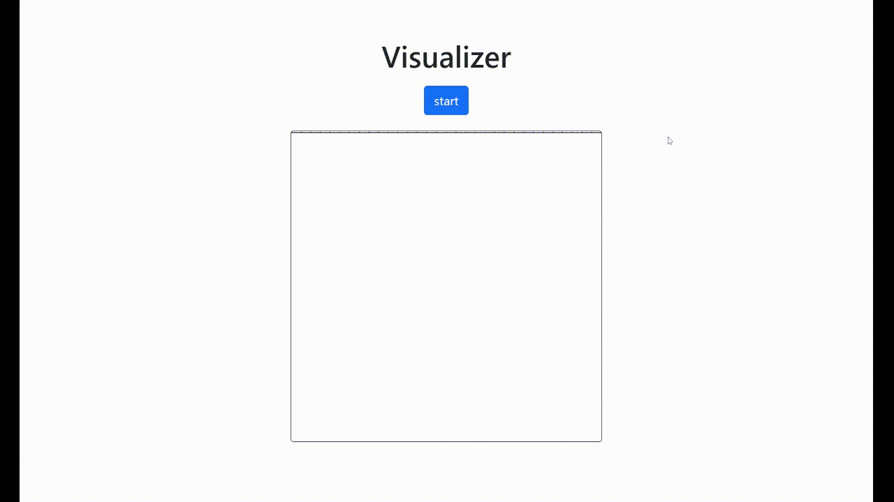

# Context

You participate in a contest with your colleagues to create the most beautiful audio visualization app.

# Requirements

Your task is to finish this web application, respecting the following requirements:

1. When the user clicks the start button, the audio `music.mp3` should start playing and the user should be able to control it by using the native browser implementation.

2. When the audio starts, the audio spectrum should be shown in real time in the frame, as shown in the screen capture below. The animation shown in the frame does not have to look exactly like the screen capture. We encourage you to make the animation look as visually appealing as you wish (e.g. adding colors). Regarding the audio controls, it may look different than the one from the screen capture depending on the browser you use.

3. The visualization update rate should be no more than 40Hz.

4. Comments should be added to the audio analysis code, so that a new developer could easily add features to the application.

# Implementation

Ensure you have Node (>=12) and NPM (>=8) installed on the computer you will be using to complete this challenge.

Choose whether you want to implement this challenge using Vue 3 or JavaScript. Only implement your solution in the one language you choose (so either Vue 3 OR JavaScript).
- The Vue version of the challenge is located in `challenge-vue/`.
- The JavaScript version of the challenge is located in `challenge-javascript/`.

Install the dependencies using `npm install` in the folder.

Then, run `npm run serve` to develop your app while serving it locally. Bear in mind that the Vue version has hot reload while the JavaScript has not. 

Once you are satisfied with your implementation, complete the `comments.txt` file by answering the questions presented in the same file. If you are unsure about how to format your answers, please check the `comments.example.txt` file which contains example answers.

# Constraints

* Do not change the music.mp3 file.
* Any new external dependency you add to this project must be justified in the `comments.txt` file.
* Assume the application will run on an up-to-date Chrome browser.
* Do NOT use canvas for the visualization! Use SVG or HTML elements instead.

# Deliverables

Once you have
* Implemented your solution in one of the folders (`challenge-vue` or `challenge-javascript`).
* Answered the questions in the `comments.txt` file.

Please do the following to send us your deliverables
* Remove the `node_modules` directories to limit the archive size. (Unix command: `rm -rf challenge-{vue,javascript}/node_modules`)
* Make an archive named `“${FirstName}_${LastName}.zip”` of all the files in this directory. Make sure the `comments.txt` file is present, as well as the two folders `challenge-vue/` and `challenge-javascript/`. Also include the folder for the language you did not implement. (Unix command: `zip -r “${FirstName}_${LastName}.zip” ./*`). 
* Go to this link: `https://cernbox.cern.ch/index.php/s/HoldQW4BLV2wSaR` and upload your archive

# Ranking

Deliverables will be assessed using the following criterias, orderded by most important to less important:
* Compliance with requirements.
* Answers given in `comments.txt`.
* Code quality (comments, code, JavaScript/Vue best practices, formatting) and efficiency.
* Any improvement to the animation visual appeal will count as bonus.

# Documentation

You might find the following links useful for completing this challenge:

### Audio
* **[AudioContext](https://developer.mozilla.org/en-US/docs/Web/API/AudioContext)**
* **[AudioContext.createMediaElementSource](https://developer.mozilla.org/en-US/docs/Web/API/AudioContext/createMediaElementSource)**
* **[AudioContext.createAnalyser](https://developer.mozilla.org/en-US/docs/Web/API/BaseAudioContext/createAnalyser)**
* **[AudioContext.getFloatTimeDomainData](https://developer.mozilla.org/en-US/docs/Web/API/AnalyserNode/getFloatTimeDomainData)**
* **[Chrome Autoplay policy](https://developer.chrome.com/blog/autoplay/)**

### Visualization
* **[Window.setInterval](https://developer.mozilla.org/en-US/docs/Web/API/setInterval)**
* **[Window.requestAnimationFrame](https://developer.mozilla.org/en-US/docs/Web/API/window/requestAnimationFrame)**

### Vue
* **[Vue 3](https://vuejs.org/guide/introduction.html#what-is-vue)**
* **[VueX Store](https://vuex.vuejs.org/guide/)**
